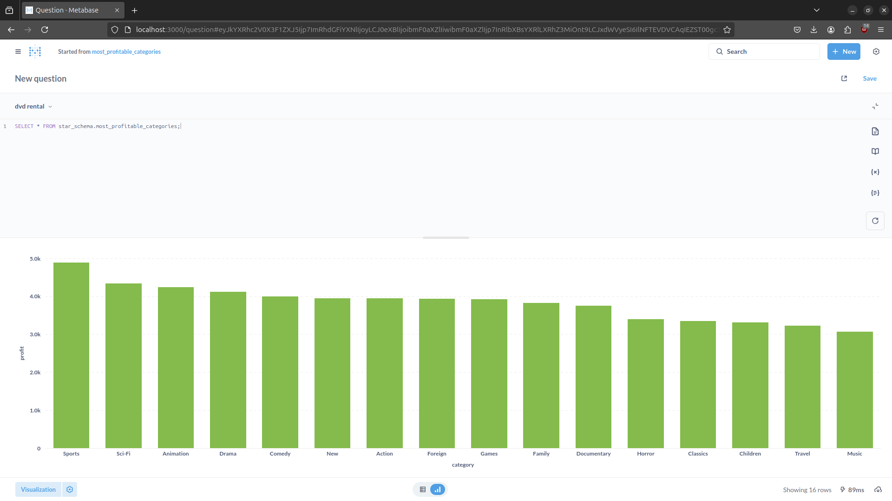

# CineStarDBT

## Overview
This project is designed to explore and model the DVD Rental database using `dbt`. The database is structured in a star schema, where the business key is `rental`. The project aims to:

- Model the database in a star schema format with dimensions and fact tables.
- Create analytical queries as views using `dbt`.
- Visualize the data using `Metabase`.
- Deploy the entire setup using `Docker Compose`.


## Prerequisites
Ensure you have the following installed:

- [Docker](https://www.docker.com/get-started)
- [Docker Compose](https://docs.docker.com/compose/)

## How to Run the Project

1. **Set Up Environment Variables:**  
   Create a `.env` file in the project root and add the following contents:
   ```env
    POSTGRES_CONTAINER_NAME=your_caonatiner_name
    POSTGRES_USER=postgres #You should use postgres as username or create one to easy restore the data 
    POSTGRES_PASSWORD=your_password
    POSTGRES_DB=your_database_name

   ```

2. **Make the Setup Script Executable:**  
   Run the following command to make the setup script executable:
   ```bash
   chmod +x setup.sh
   ```

3. **Run the Setup Script:**  
   Execute the script to set up the environment:
   ```bash
   ./setup.sh
   ```

4. **Access Metabase Dashboard:**  
   Once the containers are running, open your web browser and go to:
   ```
   http://localhost:3000
   ```
   You can now start querying and visualizing the data.

## Metabase Dashboard
Below is an example screenshot of the Metabase dashboard showcasing insights from the rental data:



